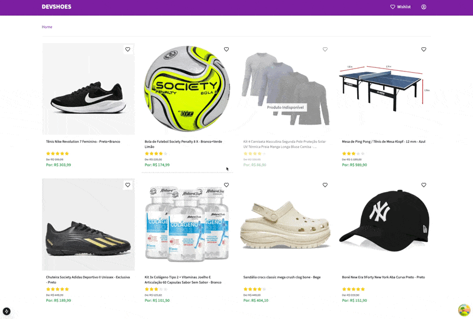

# Wishlist - Lista de desejos

Uma das funcionalidades mais interessantes em um e-commerce é
a Wishlist, ou a lista de desejos. No e-commerce o cliente pode
selecionar os produtos de sua preferência e armazená-los na sua
Wishlist. A qualquer momento o cliente pode visualizar sua Wishlist
completa, com todos os produtos que ele selecionou em uma única
tela.



## 🚀 Tecnologias

- [Next.js 15](https://nextjs.org/)
- [React 19](https://reactjs.org/)
- [TypeScript](https://www.typescriptlang.org/)
- [Tailwind CSS](https://tailwindcss.com/)
- [React Query](https://tanstack.com/query/latest)
- [Radix UI](https://www.radix-ui.com/)
- [Vitest](https://vitest.dev/)
- [Testing Library](https://testing-library.com/)
- [Commitizen](https://commitizen-tools.github.io/commitizen/)
- [Husky](https://typicode.github.io/husky/)
- [ESLint](https://eslint.org/)
- [Prettier](https://prettier.io/)

## ✨ Features

- Listagem de produtos com layout de grade responsivo
- Gerenciamento de lista de desejos (adicionar/remover produtos)
- Status de disponibilidade do produto
- Exibição de preço com suporte a preço de venda
- Avaliações do produto
- Design responsivo
- Tratamento de erros com mecanismo de retry
- Estados de carregamento
- Recursos de acessibilidade
- Commits convencionais com Commitizen
- Cobertura de testes abrangente

## 🛠 Pré-requisitos

- Node.js 18+ 
- npm or yarn or pnpm

## 🚀 Iniciando o projeto

1. Clone o repositório:
```bash
git clone https://github.com/jorginhodev/wishlist-web
```
2. Navegue até o diretório do projeto:
```bash
cd wishlist-web
```
3. Instale as dependências:
```bash
npm install
```
4. Crie um arquivo `.env.local` no diretório raiz com:
```bash
NEXT_PUBLIC_API_URL=https://wishlist-service-lckk.onrender.com/api
```
5. Execute o projeto:
```bash
npm run dev
```
6. Acesse a aplicação no navegador:
```bash
http://localhost:3000
```

## 🧪 Executando os testes

1. Execute os testes:
```bash
npm run test
```
2. Execute os testes com cobertura de testes:
```bash
npm run test:coverage
```

## 📝 Scripts

- `dev`: Executa o servidor de desenvolvimento com Turbopack
- `build`: Compila a aplicação para produção
- `start`: Inicia o servidor de produção
- `type-check`: Executa a verificação de tipos TypeScript
- `lint`: Executa ESLint
- `lint:fix`: Executa ESLint com correção automática
- `test`: Executa os testes com Vitest
- `test:coverage`: Executa os testes com cobertura de testes

## 🏗 Estrutura do projeto

```
src/
├── app/ # Next.js app directory
├── components/ # React components
├── contexts/ # React contexts
├── hooks/ # Custom React hooks
├── lib/ # Utility functions
├── services/ # API services
├── tests/ # Test utilities
└── types/ # TypeScript types
```